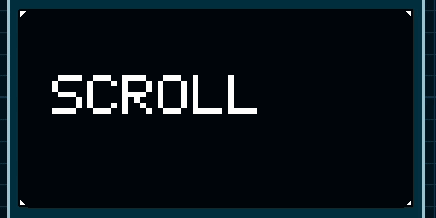

# SSD1306 OLED Graphics Library

A lightweight graphics library for SSD1306 OLED displays over I²C.

Designed for AVR microcontrollers with simplicity, portability and readability in mind.

---

<p align="center">
  
    
</p>

## Features

✔ SSD1306 initialization

✔ Framebuffer rendering

✔ Pixel drawing

✔ Lines

✔ Rectangles

✔ Filled rectangles

✔ Circles

✔ Filled circles

✔ Triangles

✔ Filled triangles

✔ Text rendering

✔ Text scaling (x1, x2, x3, x4)

✔ Bitmap rendering

✔ Sprite sheet support

✔ Sprite animation example

✔ Hardware scrolling

✔ Software scrolling

✔ Display inversion

✔ Contrast control

---

## Supported Display

SSD1306

128×64

I²C Interface

---

## Example

```cpp
i2c_init();

oled_init();

oled_clear();

oled_draw_string(
    0,
    0,
    "Hello World",
    OLED_WHITE,
    TEXT_BIG
);

oled_update();
```

---

## Hardware Scroll

```cpp
oled_scroll(
    0,
    7,
    0x00,
    scroll_direction::Right,
    0
);
```

---

## Sprite Example

```cpp
oled_draw_bitmap_frame(
    32,
    32,
    sprite_x,
    sprite_y,
    sprite,
    32,
    16,
    16,
    OLED_WHITE
);
```

---

## Documentation

The library is fully documented using Doxygen-style comments inside **oled.h**.

---

## Examples

The repository includes several example projects:

- Basic usage
- Text rendering
- Drawing primitives
- Bitmaps
- Sprites
- Hardware scrolling
- Software scrolling
- Full API demonstration

---

## Notes

The function

```cpp
oled_sprite_animation()
```

uses `_delay_ms()` and is intended only as a demonstration.

For production applications it is recommended to update animations using timers or from the main loop.

---

# Español

Biblioteca gráfica para pantallas OLED SSD1306 mediante I²C.

Incluye funciones para:

- Inicialización
- Framebuffer
- Texto escalable
- Figuras geométricas
- Bitmaps
- Sprites
- Scroll por hardware
- Scroll por software
- Control de contraste
- Inversión del display

La librería está pensada para ser simple, ligera y fácil de integrar en proyectos AVR.

Se incluyen ejemplos completos para cada funcionalidad.

La función

```cpp
oled_sprite_animation()
```

es únicamente una demostración de uso y utiliza `_delay_ms()`.

Para aplicaciones reales se recomienda controlar las animaciones mediante un temporizador o desde el bucle principal.

---

## License

MIT License
